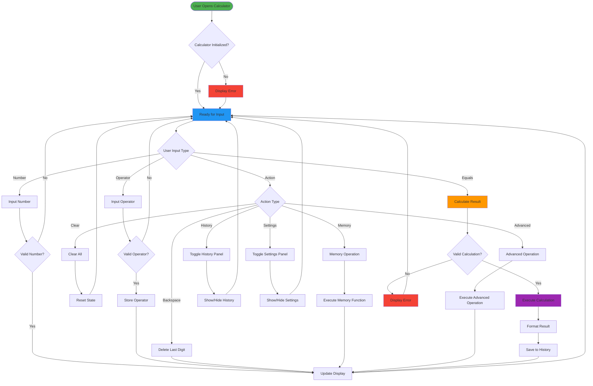
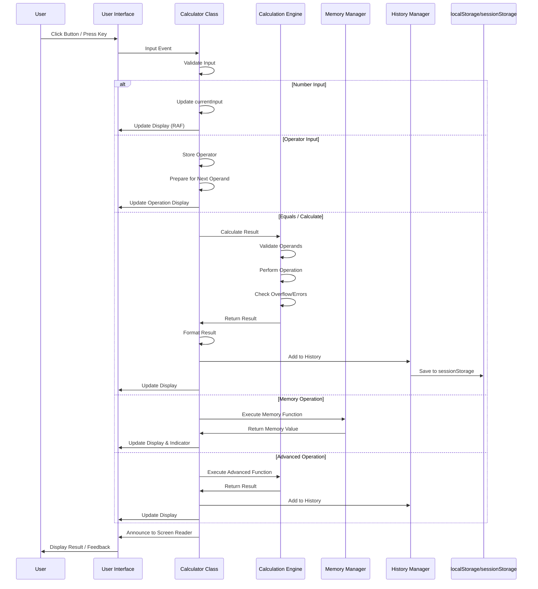
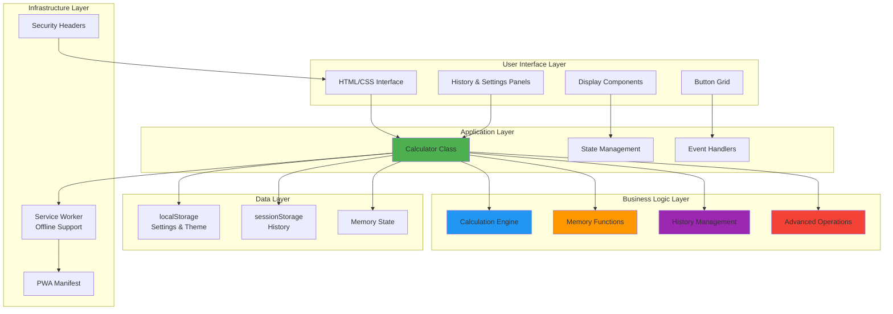
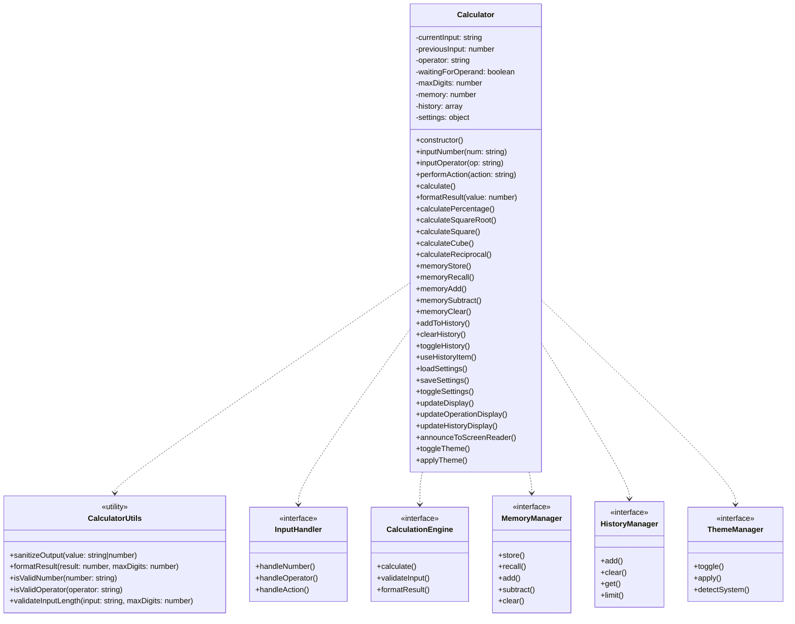
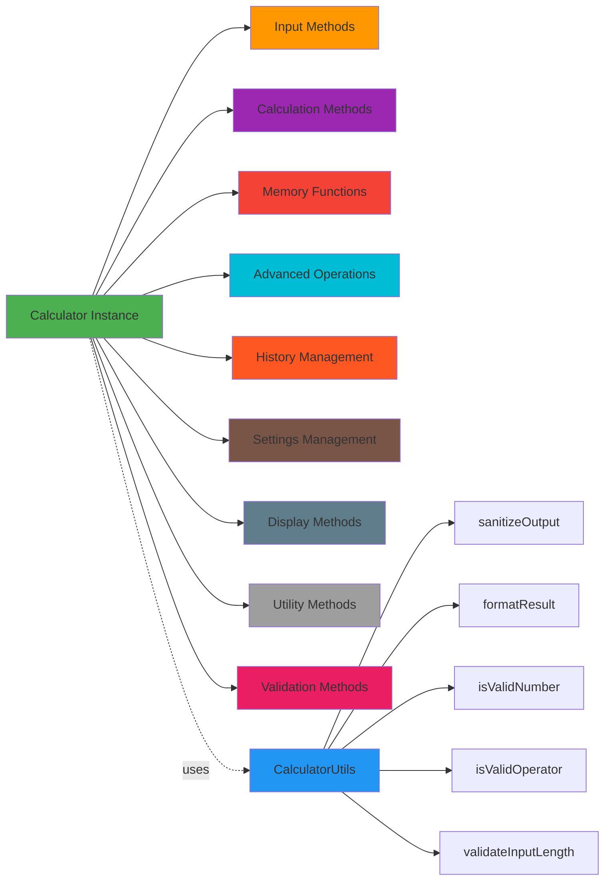

# Live Demo: <https://vanilla-calc.szemat.pro>

# Demo Web Calculator - Enterprise Edition

A production-ready, enterprise-grade web calculator built with vanilla JavaScript, featuring 8-15-digit precision, mobile-first responsive design, comprehensive accessibility support, security hardening, and performance optimizations.

**Author:** Waldemar Szemat

## Version 1.0.1

Latest release with bug fixes and improvements. See [CHANGELOG.md](CHANGELOG.md) for complete version history and detailed change log.

### Recent Updates (v1.0.1)

- Fixed operator selection bug where changing operator before entering a second number would incorrectly trigger a calculation
- Fixed duplicate "Theme" label in settings modal
- Fixed high-contrast theme toggle icon to use proper contrast SVG icon
- Fixed layout shift in Casio theme when operation display appears/disappears
- Added new "Casio" theme with ultra-realistic calculator appearance inspired by Casio DH-12
- Added new "TI SR-56 Vintage" theme with ultra-realistic vintage calculator appearance inspired by Texas Instruments SR-56
- Added comprehensive test cases for operator change behavior

## Version 1.0.0

Initial release of the Enterprise Edition calculator with comprehensive features, advanced functionality, and enterprise-grade standards.

## Features

### Core Functionality

- **8-15-digit precision** with overflow protection (configurable: 8, 10, 12, 15 digits)
- **Basic arithmetic operations**: Addition, Subtraction, Multiplication, Division
- **Advanced operations**: Percentage (%), Square Root (√), Square (x²), Cube (x³), Reciprocal (1/x - keyboard only)
- **Memory functions**: Memory Store (MS), Memory Recall (MR), Memory Add (M+), Memory Subtract (M-), Memory Clear (MC)
- **Calculation history**: View and reuse previous calculations (stored in sessionStorage)
- **Decimal point support** with proper validation
- **Enhanced error handling** for division by zero, overflow, and invalid inputs
- **Clear and backspace** functionality
- **Input validation** and sanitization
- **Settings panel**: Customize precision, theme, and history limit (persisted in localStorage)

### Security Enhancements

- **XSS Prevention**: Enhanced output sanitization using textContent and comprehensive character removal (HTML tags, quotes, control characters, ampersands)
- **Input Validation**: Comprehensive validation for all user inputs with whitelist-based operator validation
- **Enhanced Input Length Validation**: Defense-in-depth approach with maximum input length limits beyond precision constraints (maxDigits * 2 + 10 characters)
- **Security Headers** (via .htaccess):
  - X-Frame-Options: DENY (prevents clickjacking)
  - X-Content-Type-Options: nosniff (prevents MIME type sniffing)
  - X-XSS-Protection: 1; mode=block
  - Referrer-Policy: strict-origin-when-cross-origin
  - Content-Security-Policy: Comprehensive CSP with strict directives
  - Permissions-Policy: Restricts geolocation, microphone, camera
  - **CSP Reporting**: Documentation included for enabling CSP violation reporting (see `.htaccess` comments)
- **Directory Protection**:
  - .htaccess files prevent directory listing in assets/, assets/js/utils/, tests/, and root
  - index.html files in subdirectories block direct access to protected directories (assets/, assets/js/, assets/js/utils/, assets/css/, assets/icons/, tests/)
  - robots.txt prevents search engine indexing of asset directories
- **Safe Storage Access**: Graceful fallback when localStorage/sessionStorage is unavailable
- **Operator Validation**: Whitelist-based operator validation prevents injection attacks
- **Number Validation**: Regex-based number input validation with overflow protection
- **Utility Functions Module**: Extracted pure utility functions for better security, testability, and maintainability

### User Experience

- **Mobile-first responsive design** that works on all devices
- **Enhanced theme system**: Light, Dark, High Contrast, Casio, and TI SR-56 Vintage themes (WCAG AAA compliant)
- **Auto theme detection**: Respects system color scheme preferences
- **Calculation history**: Sidebar panel with clickable history items
- **Memory indicator**: Visual indicator when memory has stored values
- **Settings panel**: Customize calculator behavior and appearance
- **Smooth animations** and micro-interactions with performance optimization
- **Enhanced keyboard support** with focus management
- **Touch-friendly interface** with visual feedback
- **Performance monitoring** built-in with Core Web Vitals tracking

### Accessibility (WCAG 2.2 AAA Compliant)

- **Enhanced screen reader support** with proper ARIA labels and live regions
- **Comprehensive keyboard navigation** for all functions including new features
- **Skip links** for keyboard navigation (jump to main content or calculator display)
- **High contrast theme**: Dedicated high contrast mode (WCAG AAA)
- **Reduced motion** support for users with vestibular disorders
- **Focus management** and visual indicators
- **ARIA grid roles** for button layout with proper row/column indices
- **Semantic HTML5** structure with proper roles
- **Dynamic ARIA attributes** for state changes
- **History panel accessibility**: Full keyboard navigation and screen reader support
- **Settings panel accessibility**: Accessible form controls and keyboard navigation

### Technical Excellence

- **Vanilla JavaScript** - No dependencies
- **Enterprise-grade error handling** with try-catch and validation
- **Performance optimizations**:
  - Event delegation for efficient event handling (buttons and history panel)
  - RequestAnimationFrame for smooth display updates
  - Debouncing for screen reader announcements
  - DocumentFragment for batch DOM updates
  - CSS containment for layout optimization
  - History panel event delegation (O(n) → O(1) listeners)
- **Core Web Vitals monitoring**: LCP, INP, CLS, FCP tracking
- **Performance monitoring** with operation timing
- **Code documentation** with comprehensive JSDoc comments
- **Security-first architecture** with enhanced input/output sanitization
- **Modular code organization** with utility functions extracted to separate module
- **Semantic HTML5** structure
- **Enhanced design system**: Expanded CSS custom properties, elevation system, animation system
- **CSS Grid/Flexbox** for responsive layout
- **CSS Custom Properties** for theming with 8px grid system
- **Progressive enhancement** approach
- **Cross-browser compatibility**

## Quick Start

### Prerequisites

- Any modern web server (Apache, Nginx, or simple HTTP server)
- Modern web browser with JavaScript enabled

### Installation

1. **Clone or download** the project files:

   ```bash
   git clone <repository-url>
   cd demo-vanilla-calculator
   ```

2. **Serve the files** using any web server:

   **Option A: Python (if installed)**

   ```bash
   # Python 3
   python -m http.server 8000
   
   # Python 2
   python -m SimpleHTTPServer 8000
   ```

   **Option B: Node.js (if installed)**

   ```bash
   npx serve .
   ```

   **Option C: PHP (if installed)**

   ```bash
   php -S localhost:8000
   ```

3. **Open your browser** and navigate to:

   ```text
   http://localhost:8000
   ```

### File Structure

```mermaid
graph TD
    A[demo-vanilla-calculator/] --> B[index.html]
    A --> C[assets/]
    A --> D[tests/]
    A --> F[sw.js]
    A --> G[site.webmanifest]
    A --> H[sitemap.xml]
    A --> I[README.md]
    A --> J[.htaccess]
    A --> K[robots.txt]
    A --> L[CNAME]
    A --> M[LICENSE]
    
    C --> C1[css/]
    C --> C2[js/]
    C --> C3[icons/]
    C --> C4[.htaccess]
    C --> C5[index.html]
    
    C1 --> C1A[styles.css]
    C1 --> C1B[403.css]
    C1 --> C1C[.htaccess]
    C1 --> C1D[index.html]
    C2 --> C2A[calculator.js]
    C2 --> C2B[utils/]
    C2 --> C2C[index.html]
    C2 --> C2D[.htaccess]
    C2B --> C2B1[calculator-utils.js]
    C2B --> C2B2[.htaccess]
    C2B --> C2B3[index.html]
    C3 --> C3A[favicon.ico]
    C3 --> C3B[favicon.svg]
    C3 --> C3C[favicon-16x16.png]
    C3 --> C3D[favicon-16x16.svg]
    C3 --> C3E[favicon-32x32.png]
    C3 --> C3F[apple-touch-icon.png]
    C3 --> C3G[android-chrome-192x192.png]
    C3 --> C3H[android-chrome-512x512.png]
    C3 --> C3I[.htaccess]
    C3 --> C3J[index.html]
    
    D --> D1[tests.html]
    D --> D2[.htaccess]
    D --> D3[index.html]
    
    style A fill:#e1f5ff
    style B fill:#fff4e1
    style C fill:#e8f5e9
    style D fill:#fce4ec
    style F fill:#f3e5f5
    style G fill:#f3e5f5
    style H fill:#e3f2fd
    style J fill:#ffebee
    style K fill:#ffebee
    style L fill:#fff3e0
```



**Text-based structure:**

```text
demo-vanilla-calculator/
├── index.html               # Main application file
├── assets/
│   ├── css/
│   │   ├── styles.css       # Responsive CSS with enhanced design system
│   │   ├── 403.css          # Shared CSS for 403 Forbidden pages
│   │   ├── .htaccess        # Security: Prevents directory listing
│   │   └── index.html       # Directory protection (403 Forbidden)
│   ├── js/
│   │   ├── calculator.js    # Calculator engine with all features
│   │   ├── utils/           # Utility functions module
│   │   │   ├── calculator-utils.js  # Pure utility functions (security, validation, formatting)
│   │   │   ├── .htaccess    # Security: Prevents directory listing
│   │   │   └── index.html   # Directory protection (403 Forbidden)
│   │   ├── index.html       # Directory protection (403 Forbidden)
│   │   └── .htaccess        # Security: Prevents directory listing
│   ├── icons/               # Favicon and app icons
│   │   ├── favicon.ico
│   │   ├── favicon.svg
│   │   ├── favicon-16x16.png
│   │   ├── favicon-16x16.svg
│   │   ├── favicon-32x32.png
│   │   ├── apple-touch-icon.png
│   │   ├── android-chrome-192x192.png
│   │   ├── android-chrome-512x512.png
│   │   ├── .htaccess        # Security: Prevents directory listing
│   │   └── index.html       # Directory protection (403 Forbidden)
│   ├── .htaccess            # Security: Prevents directory listing and blocks index.html
│   └── index.html           # Directory protection (403 Forbidden)
├── tests/
│   ├── tests.html           # Comprehensive test suite
│   ├── .htaccess            # Security: Prevents directory listing
│   └── index.html           # Directory protection (403 Forbidden)
├── sw.js                   # Service worker for offline support and PWA
├── site.webmanifest        # Web app manifest for PWA
├── sitemap.xml             # XML sitemap for search engines
├── .htaccess               # Security headers and directory protection
├── robots.txt              # Search engine exclusion rules and sitemap reference
├── CNAME                   # Custom domain configuration (vanilla-calc.szemat.pro)
├── LICENSE                 # MIT License
├── README.md               # This documentation
└── CHANGELOG.md            # Version history and change log
```

## Usage

### User Flow



### Calculation Flow



### Basic Operations

- **Numbers**: Click number buttons or use keyboard (0-9)
- **Operations**: Click operator buttons or use keyboard (+, -, *, /)
- **Equals**: Click = button or press Enter
- **Clear**: Click C button or press Escape
- **Clear Entry**: Click CE button or press Delete
- **Backspace**: Click the backspace button or press Backspace
- **Decimal**: Click . button or press . key

### Memory Functions

- **MS (Memory Store)**: Store current display value in memory
- **MR (Memory Recall)**: Recall stored value from memory
- **M+ (Memory Add)**: Add current value to memory
- **M- (Memory Subtract)**: Subtract current value from memory
- **MC (Memory Clear)**: Clear memory
- **Memory Indicator**: Purple dot appears in header when memory has value

### Advanced Operations

- **% (Percentage)**: Calculate percentage (e.g., 50% = 0.5)
- **√ (Square Root)**: Calculate square root of current value
- **x² (Square)**: Calculate square of current value
- **x³ (Cube)**: Calculate cube of current value
- **1/x (Reciprocal)**: Calculate reciprocal (1 divided by current value) - available via keyboard shortcut (I or i) only

### Calculation History

- **View History**: Click the history button in header to open history panel
- **Use Result**: Click any history item to use its result in current calculation
- **Clear History**: Click the clear button in history panel
- **Keyboard Navigation**: Use arrow keys and Enter to navigate history

### Settings

- **Open Settings**: Click the settings button in header
- **Theme Selection**: Choose from Light, Dark, High Contrast, Casio, or TI SR-56 Vintage
- **Precision**: Set calculation precision (8, 10, 12, or 15 digits)
- **History Limit**: Configure maximum history items (25, 50, or 100)
- **All settings persist** across sessions using localStorage

### Keyboard Shortcuts

| Key | Action |
|-----|--------|
| `0-9` | Input numbers |
| `+` | Addition |
| `-` | Subtraction |
| `*` | Multiplication |
| `/` | Division |
| `=` or `Enter` | Calculate result |
| `.` | Decimal point |
| `Escape` | Clear all |
| `Backspace` | Delete last digit |
| `Delete` | Clear entry |
| `C` | Clear all |
| `%` | Percentage |
| `R` or `r` | Square root (√) |
| `S` or `s` | Square (x²) |
| `X` or `x` | Cube (x³) |
| `I` or `i` | Reciprocal (1/x) |
| `M` or `m` | Memory Recall (MR) |
| `Shift+M` | Memory Store (MS) |
| `Ctrl+M` or `Cmd+M` | Memory Store (MS) |
| `Ctrl+=` or `Ctrl+Numpad+` | Memory Add (M+) |
| `Ctrl+-` or `Ctrl+Numpad-` | Memory Subtract (M-) |
| `Ctrl+0` or `Ctrl+Numpad0` | Memory Clear (MC) |

### Theme Toggle

- Click the theme toggle button in the top-right corner to cycle through themes
- Available themes: Light → Dark → High Contrast → Casio → TI SR-56 Vintage → Light (cycles continuously)
- Theme preference is automatically saved in localStorage
- System preference detection: Auto-detects dark mode when no theme is set

## Testing

### Running Tests

1. Open `tests/tests.html` in your browser
2. Click "Run All Tests" to execute the complete test suite
3. Or run individual test suites:
   - Basic Operations
   - Advanced Features
   - Memory Functions
   - Advanced Operations
   - History
   - Error Handling
   - Accessibility
4. View results organized by category with pass/fail indicators

### Test Coverage

- **Unit tests** for all calculator functions
- **Memory function tests**: MS, MR, M+, M-, MC
- **Advanced operations tests**: %, √, x², x³, 1/x
- **History tests**: History storage, limit enforcement, item reuse
- **Integration tests** for user workflows
- **Accessibility tests** for WCAG compliance
- **Error handling tests** for edge cases
- **Cross-browser compatibility** validation

## Architecture

### System Architecture



### Design Patterns

- **Module Pattern**: Encapsulated calculator class
- **Observer Pattern**: Event-driven UI updates
- **Strategy Pattern**: Different calculation methods for different operations

### Component Structure



**Code Organization:**

```javascript
class Calculator {
    // State management
    constructor() { /* Initialize calculator state */ }
    
    // Input handling
    inputNumber() { /* Handle number input - uses CalculatorUtils */ }
    inputOperator() { /* Handle operator input - uses CalculatorUtils */ }
    performAction() { /* Handle special actions */ }
    
    // Calculation engine
    calculate() { /* Perform calculations */ }
    formatResult() { /* Format output - uses CalculatorUtils */ }
    
    // Advanced operations
    calculatePercentage() { /* Calculate percentage */ }
    calculateSquareRoot() { /* Calculate square root */ }
    calculateSquare() { /* Calculate square */ }
    calculateCube() { /* Calculate cube */ }
    calculateReciprocal() { /* Calculate reciprocal */ }
    
    // Memory functions
    memoryStore() { /* Store in memory */ }
    memoryRecall() { /* Recall from memory */ }
    memoryAdd() { /* Add to memory */ }
    memorySubtract() { /* Subtract from memory */ }
    memoryClear() { /* Clear memory */ }
    
    // History management
    addToHistory() { /* Add calculation to history */ }
    clearHistory() { /* Clear calculation history */ }
    toggleHistory() { /* Toggle history panel */ }
    useHistoryItem() { /* Use history item as input */ }
    
    // Settings
    loadSettings() { /* Load settings from localStorage */ }
    saveSettings() { /* Save settings to localStorage */ }
    toggleSettings() { /* Toggle settings panel */ }
    
    // UI management
    updateDisplay() { /* Update display (with RAF optimization) */ }
    updateOperationDisplay() { /* Update operation display */ }
    updateHistoryDisplay() { /* Update history panel (with DocumentFragment + event delegation) */ }
    
    // Accessibility
    announceToScreenReader() { /* Screen reader support */ }
    debouncedAnnounceToScreenReader() { /* Debounced announcements */ }
    
    // Theme management
    toggleTheme() { /* Theme switching (5 themes: Light, Dark, High Contrast, Casio, TI SR-56 Vintage) */ }
    applyTheme() { /* Apply current theme */ }
    
    // Validation (delegates to CalculatorUtils)
    isValidNumber() { /* Uses CalculatorUtils.isValidNumber */ }
    isValidOperator() { /* Uses CalculatorUtils.isValidOperator */ }
    sanitizeOutput() { /* Uses CalculatorUtils.sanitizeOutput */ }
}

// Utility Functions Module (separate file)
CalculatorUtils {
    sanitizeOutput(value) { /* Enhanced XSS prevention */ }
    formatResult(result, maxDigits) { /* Result formatting */ }
    isValidNumber(number) { /* Number validation */ }
    isValidOperator(operator) { /* Operator validation */ }
    validateInputLength(input, maxDigits) { /* Input length validation */ }
}
```

**Code Organization Benefits:**

- **Modular Architecture**: Clear separation between Calculator class and utility functions
- **Testability**: Utility functions are pure and easily testable
- **Maintainability**: Centralized validation and sanitization logic
- **Reusability**: Utility functions can be used independently
- **Performance**: Event delegation reduces memory footprint (O(n) → O(1) listeners)

### CSS Architecture

- **Mobile-first approach** with progressive enhancement
- **CSS Custom Properties** for theming and maintainability
- **BEM methodology** for class naming
- **Responsive design** with flexible grid system

## Customization

### Adding New Operations

1. Add operator button to HTML:

   ```html
   <button class="btn btn-operator" data-operator="%" aria-label="Modulo">%</button>
   ```

2. Update JavaScript calculation method:

   ```javascript
   case '%':
       result = prev % current;
       break;
   ```

### Styling Customization

Modify CSS custom properties in `assets/css/styles.css`:

```css
:root {
    --btn-operator-bg: #your-color;
    --font-size-lg: 1.2rem;
    --spacing-md: 1.2rem;
}
```

### Theme Customization

Add new themes by extending the theme system:

```javascript
// In assets/js/calculator.js
const themes = {
    light: { /* light theme variables */ },
    dark: { /* dark theme variables */ },
    highContrast: { /* high contrast variables */ }
};
```

## Browser Support

### Supported Browsers

- **Chrome** 60+
- **Firefox** 55+
- **Safari** 12+
- **Edge** 79+
- **Mobile browsers** (iOS Safari, Chrome Mobile)

### Progressive Enhancement

- **Core functionality** works without JavaScript (basic HTML structure)
- **Enhanced experience** with JavaScript enabled
- **Graceful degradation** for older browsers
- **Service Worker**: Optional offline support (degrades gracefully if unavailable)
- **Theme system**: Falls back to light theme if localStorage unavailable

## Progressive Web App (PWA)

The calculator functions as a Progressive Web App (PWA) with the following features:

### PWA Capabilities

- **Offline support**: Service Worker (sw.js) caches essential files for offline operation
  - Caches: index.html, CSS, JS, fonts, and test files
  - Network-first strategy with cache fallback
  - Automatic cache versioning and cleanup
- **App-like experience**: Standalone display mode (configured in site.webmanifest)
- **Installable**: Can be added to home screen on mobile and desktop
- **App icons**: Multiple icon sizes for different platforms:
  - Favicons (ICO, PNG, SVG) for browser tabs
  - Apple Touch Icon (180x180) for iOS
  - Android Chrome icons (192x192, 512x512) for Android
- **Theme color**: Matches browser UI theme (#007bff)
- **Service Worker registration**: Automatic registration with error handling

### PWA Manifest

The `site.webmanifest` file configures:

- App name and short name
- Display mode: standalone (removes browser UI)
- Orientation: portrait (optimized for mobile)
- Theme and background colors
- Icon set for all platforms and sizes

### Service Worker

The `sw.js` file implements:

- **Installation**: Caches static assets on first load
- **Activation**: Cleans up old caches automatically
- **Fetch interception**: Serves cached content when offline
- **Cache strategy**: Network-first with cache fallback
- **Version management**: Cache versioning for seamless updates

## Deployment

### Static Hosting

The calculator is designed for static hosting and works with:

- **GitHub Pages** (with CNAME support for custom domains)
- **Netlify**
- **Vercel**
- **AWS S3 + CloudFront**
- **Apache/Nginx** with .htaccess support
- **Any web server** serving static files

### Production Deployment

1. **Minify files** (optional):

   ```bash
   # Using tools like UglifyJS, CleanCSS
   uglifyjs assets/js/calculator.js -o assets/js/calculator.min.js
   cleancss -o assets/css/styles.min.css assets/css/styles.css
   ```

2. **Configure web server**:
   - Apache: .htaccess files are included for security headers and compression
   - Nginx: Convert .htaccess rules to nginx.conf
   - Enable compression (gzip/brotli) for text files
   - Set proper cache headers for static assets
   - Configure HTTPS with valid SSL certificate

3. **Security configuration**:
   - Ensure .htaccess files are processed (Apache)
   - Verify security headers are set correctly
   - Test directory protection (try accessing /assets/ directly)
   - Validate robots.txt is accessible

4. **Custom domain** (optional):
   - Update CNAME file with your domain
   - Configure DNS records as per hosting provider

### Performance Optimization

- **Service Worker**: Automatic caching for offline support and faster subsequent loads
- **Resource hints**: Preconnect and DNS prefetch for Google Fonts
- **Cache control**: .htaccess includes cache headers for static assets (1 year for images, 1 month for CSS/JS)
- **Compression**: .htaccess includes deflate compression for text files
- **Image optimization**: All icons are optimized PNG/SVG formats

## Security Considerations

### Client-Side Security

- **Input validation**: Comprehensive validation with whitelist-based operator checking
- **Enhanced input length validation**: Defense-in-depth approach with maximum length limits (maxDigits * 2 + 10 characters) enforced in multiple input methods
- **Enhanced output sanitization**: Comprehensive XSS prevention removing HTML tags, quotes, control characters, and ampersands while preserving calculator functionality
- **Utility functions module**: Extracted security utilities for better maintainability and testability
- **Output sanitization**: Uses textContent instead of innerHTML to prevent XSS
- **No external dependencies**: Reduces attack surface and supply chain risks
- **Content Security Policy**: Strict CSP configured in .htaccess
- **Safe storage access**: Try-catch blocks around all localStorage/sessionStorage operations

### Server-Side Security (via .htaccess)

- **Directory listing prevention**: Options -Indexes in all protected directories (assets/, assets/js/utils/, tests/, root)
- **Security headers**: X-Frame-Options, X-Content-Type-Options, X-XSS-Protection, Referrer-Policy, CSP, Permissions-Policy
- **Directory protection**: index.html files in subdirectories block direct directory access (assets/, assets/js/, assets/js/utils/, assets/css/, assets/icons/, tests/). These security pages use external CSS (403.css) for consistent styling.
- **Hidden file protection**: Blocks access to files starting with . (except .htaccess)
- **Search engine exclusion**: robots.txt prevents indexing of asset directories

### Security Features

- **Directory Protection**:
  - Root .htaccess: Prevents directory listing, sets security headers, enables compression
  - assets/.htaccess: Blocks directory listing and access to index.html
  - tests/.htaccess: Prevents directory listing, allows only tests.html
  - index.html files: Return 403 Forbidden when accessing directories directly (use external 403.css for styling)

- **Security Headers** (set via Apache .htaccess):
  - X-Frame-Options: DENY (prevents clickjacking)
  - X-Content-Type-Options: nosniff (prevents MIME sniffing)
  - X-XSS-Protection: 1; mode=block
  - Referrer-Policy: strict-origin-when-cross-origin
  - Content-Security-Policy: Comprehensive policy with strict directives
  - Permissions-Policy: Restricts geolocation, microphone, camera

### Best Practices

- **HTTPS deployment**: Required for Service Worker and secure cookies
- **Regular security audits**: Review .htaccess rules and CSP policies
- **Input length limits**: Configurable digit limit (8-15 digits) enforced in calculator logic, with additional defense-in-depth validation beyond precision limits
- **Error handling**: All errors handled gracefully without information disclosure
- **No sensitive data storage**: Only user preferences and calculation history (no personal data)
- **Session-based history**: History stored in sessionStorage (cleared on tab close)

## Performance Metrics

### Target Performance

- **First Contentful Paint (FCP)**: < 1.8s
- **Largest Contentful Paint (LCP)**: < 2.5s
- **Interaction to Next Paint (INP)**: < 200ms (primary responsiveness metric)
- **Cumulative Layout Shift (CLS)**: < 0.1
- **Note**: FID (First Input Delay) is deprecated; INP is the current standard

### Performance Monitoring

- **Built-in Core Web Vitals tracking**: Real-time monitoring of LCP, INP, CLS, and FCP
- **Verbose mode**: Set `window.PERFORMANCE_VERBOSE = true` in browser console for detailed logs
- **Automatic warning suppression**: Warnings are limited to prevent console spam (first 3-5 warnings shown)
- **Test page detection**: CLS warnings are automatically suppressed on test pages
- **Performance thresholds**: Only logs warnings when metrics exceed targets

### Production Performance Monitoring

**Status:** Documented (requires external monitoring service)

For production environments, consider implementing:

1. **Real User Monitoring (RUM)**:
   - Services: Google Analytics, New Relic, Datadog, Sentry
   - Track Core Web Vitals in production
   - Monitor user experience metrics

2. **Synthetic Monitoring**:
   - Services: Pingdom, UptimeRobot, StatusCake
   - Automated checks for availability and performance
   - Alert on performance degradation

3. **CSP Reporting**:
   - Configure CSP `report-uri` or `report-to` directive in `.htaccess`
   - Use services like Report URI, Sentry, or custom endpoint
   - Monitor security policy violations

4. **Performance Budgets**:
   - Define targets: FCP < 1.8s, LCP < 2.5s, INP < 200ms, CLS < 0.1
   - Set up alerts when budgets are exceeded
   - Regular performance audits

**Note:** Production monitoring is documented but requires external services. Current implementation includes built-in Core Web Vitals tracking for development and testing.

### Optimization Features

- **Event delegation**: Single event listener for all buttons and history items (reduces memory footprint)
  - Button grid: O(1) listener instead of O(n) for n buttons
  - History panel: O(1) listeners instead of O(n) for n history items
- **RequestAnimationFrame**: Smooth display updates with efficient batching
- **Debouncing**: Screen reader announcements (150ms delay)
- **DocumentFragment**: Batch DOM updates for history panel (reduces reflows)
- **CSS containment**: Layout optimization hints for better rendering performance
- **Passive event listeners**: Improved scroll and touch performance (except where preventDefault is needed)
- **Will-change hints**: GPU acceleration for animations
- **Minimal JavaScript bundle**: No external dependencies, optimized code size
- **Efficient DOM manipulation**: Uses textContent for security and performance
- **CSS optimization**: Custom properties, design tokens, and 8px grid system
- **Service Worker caching**: Offline support with intelligent cache management
- **Utility functions module**: Extracted pure functions for better performance and testability
- **Virtual scrolling preparation**: Code comments document virtual scrolling implementation for large history lists (100+ items)

## API Documentation

This section provides comprehensive API documentation for the Calculator class and utility functions. The calculator is instantiated automatically when the page loads and is available globally as `window.calculator`.

### API Overview



### Calculator Class

#### Constructor

##### `new Calculator()`

Initializes a new calculator instance with enterprise-grade configuration.

**Parameters:** None

**Returns:** `Calculator` instance

**Throws:** `Error` if required DOM elements are missing

**Example:**

```javascript
// Calculator is automatically instantiated
// Access via: window.calculator
const calc = window.calculator;
```

---

### Public Methods

#### Input Methods

##### `inputNumber(number: string)`

Inputs a single digit number with validation and security checks.

**Parameters:**

- `number` (string): Single digit (0-9)

**Returns:** `void`

**Security:**

- Validates input is a single digit
- Checks input length limits (defense-in-depth)
- Shows error message if validation fails

**Example:**

```javascript
calculator.inputNumber('5');
```

---

##### `inputOperator(operator: string)`

Inputs a mathematical operator.

**Parameters:**

- `operator` (string): One of '+', '−', '×', '÷'

**Returns:** `void`

**Security:**

- Validates operator against whitelist
- Prevents injection attacks

**Example:**

```javascript
calculator.inputOperator('+');
```

---

##### `inputDecimal()`

Inputs a decimal point with validation.

**Parameters:** None

**Returns:** `void`

**Security:**

- Validates input length before adding decimal
- Shows error if maximum length exceeded

**Example:**

```javascript
calculator.inputDecimal();
```

---

##### `performAction(action: string)`

Performs a calculator action.

**Parameters:**

- `action` (string): Action name (see Actions below)

**Returns:** `void`

**Available Actions:**

- `'clear'` - Clear all
- `'clear-entry'` - Clear current entry
- `'backspace'` - Delete last digit
- `'decimal'` - Input decimal point
- `'equals'` - Calculate result
- `'memory-store'` - Memory Store (MS)
- `'memory-recall'` - Memory Recall (MR)
- `'memory-add'` - Memory Add (M+)
- `'memory-subtract'` - Memory Subtract (M-)
- `'memory-clear'` - Memory Clear (MC)
- `'percentage'` - Calculate percentage
- `'square-root'` - Calculate square root
- `'square'` - Calculate square (x²)
- `'cube'` - Calculate cube (x³)
- `'reciprocal'` - Calculate reciprocal (1/x)
- `'toggle-history'` - Toggle history panel
- `'toggle-settings'` - Toggle settings panel

**Example:**

```javascript
calculator.performAction('clear');
calculator.performAction('equals');
```

---

#### Calculation Methods

##### `calculate()`

Performs the current calculation.

**Parameters:** None

**Returns:** `number|undefined` - Calculation result or undefined if error

**Example:**

```javascript
calculator.inputNumber('2');
calculator.inputOperator('+');
calculator.inputNumber('3');
const result = calculator.calculate(); // Returns 5
```

---

##### `formatResult(result: number)`

Formats a calculation result for display.

**Parameters:**

- `result` (number): Calculation result

**Returns:** `string` - Formatted result string

**Notes:**

- Handles large numbers with scientific notation
- Respects precision limits (maxDigits)
- Removes trailing zeros

**Example:**

```javascript
const formatted = calculator.formatResult(123.456); // Returns "123.456"
```

---

#### Memory Functions

##### `memoryStore()`

Stores current display value in memory.

**Parameters:** None

**Returns:** `void`

**Example:**

```javascript
calculator.inputNumber('5');
calculator.memoryStore();
```

---

##### `memoryRecall()`

Recalls stored value from memory.

**Parameters:** None

**Returns:** `void`

**Example:**

```javascript
calculator.memoryRecall();
```

---

##### `memoryAdd()`

Adds current display value to memory.

**Parameters:** None

**Returns:** `void`

**Example:**

```javascript
calculator.inputNumber('3');
calculator.memoryAdd(); // Adds 3 to stored memory
```

---

##### `memorySubtract()`

Subtracts current display value from memory.

**Parameters:** None

**Returns:** `void`

**Example:**

```javascript
calculator.inputNumber('2');
calculator.memorySubtract(); // Subtracts 2 from stored memory
```

---

##### `memoryClear()`

Clears stored memory.

**Parameters:** None

**Returns:** `void`

**Example:**

```javascript
calculator.memoryClear();
```

---

#### Advanced Operations

##### `calculatePercentage()`

Calculates percentage of current value.

**Parameters:** None

**Returns:** `void`

**Example:**

```javascript
calculator.inputNumber('5');
calculator.inputNumber('0');
calculator.calculatePercentage(); // Returns 0.5
```

---

##### `calculateSquareRoot()`

Calculates square root of current value.

**Parameters:** None

**Returns:** `void`

**Example:**

```javascript
calculator.inputNumber('9');
calculator.calculateSquareRoot(); // Returns 3
```

---

##### `calculateSquare()`

Calculates square of current value.

**Parameters:** None

**Returns:** `void`

**Example:**

```javascript
calculator.inputNumber('5');
calculator.calculateSquare(); // Returns 25
```

---

##### `calculateCube()`

Calculates cube of current value.

**Parameters:** None

**Returns:** `void`

**Example:**

```javascript
calculator.inputNumber('3');
calculator.calculateCube(); // Returns 27
```

---

##### `calculateReciprocal()`

Calculates reciprocal (1/x) of current value.

**Parameters:** None

**Returns:** `void`

**Throws:** Error if dividing by zero

**Example:**

```javascript
calculator.inputNumber('4');
calculator.calculateReciprocal(); // Returns 0.25
```

---

#### History Management

##### `addToHistory(expression: string, result: number)`

Adds a calculation to history.

**Parameters:**

- `expression` (string): Calculation expression (e.g., "2 + 3")
- `result` (number): Calculation result

**Returns:** `void`

**Example:**

```javascript
calculator.addToHistory('2 + 3', 5);
```

---

##### `clearHistory()`

Clears all calculation history.

**Parameters:** None

**Returns:** `void`

**Example:**

```javascript
calculator.clearHistory();
```

---

##### `toggleHistory()`

Toggles the history panel visibility.

**Parameters:** None

**Returns:** `void`

**Example:**

```javascript
calculator.toggleHistory();
```

---

##### `useHistoryItem(value: string|number)`

Uses a history item result as input.

**Parameters:**

- `value` (string|number): History item result value

**Returns:** `void`

**Example:**

```javascript
calculator.useHistoryItem('5');
```

---

#### Settings Management

##### `loadSettings()`

Loads settings from localStorage.

**Parameters:** None

**Returns:** `void`

**Settings:**

- `precision` (number): 8, 10, 12, or 15 digits
- `historyLimit` (number): 25, 50, or 100 items

**Example:**

```javascript
calculator.loadSettings();
```

---

##### `saveSettings()`

Saves settings to localStorage.

**Parameters:** None

**Returns:** `void`

**Example:**

```javascript
calculator.settings.precision = 15;
calculator.saveSettings();
```

---

##### `toggleSettings()`

Toggles the settings panel visibility.

**Parameters:** None

**Returns:** `void`

**Example:**

```javascript
calculator.toggleSettings();
```

---

#### Display Methods

##### `updateDisplay()`

Updates the main display with current input.

**Parameters:** None

**Returns:** `void`

**Performance:**

- Uses RequestAnimationFrame for smooth updates
- Batches display updates

**Example:**

```javascript
calculator.currentInput = '123';
calculator.updateDisplay();
```

---

##### `updateOperationDisplay()`

Updates the operation display showing current operation.

**Parameters:** None

**Returns:** `void`

**Example:**

```javascript
calculator.previousInput = 5;
calculator.operator = '+';
calculator.updateOperationDisplay(); // Shows "5 +"
```

---

##### `updateHistoryDisplay()`

Updates the history panel with all history items.

**Parameters:** None

**Returns:** `void`

**Performance:**

- Uses DocumentFragment for batch DOM updates
- Uses event delegation for history items (O(1) listeners)
- Limits visible items to 50

**Example:**

```javascript
calculator.updateHistoryDisplay();
```

---

#### Utility Methods

##### `clear()`

Clears all calculator state.

**Parameters:** None

**Returns:** `void`

**Example:**

```javascript
calculator.clear();
```

---

##### `clearEntry()`

Clears current entry only.

**Parameters:** None

**Returns:** `void`

**Example:**

```javascript
calculator.clearEntry();
```

---

##### `backspace()`

Deletes the last digit.

**Parameters:** None

**Returns:** `void`

**Example:**

```javascript
calculator.backspace();
```

---

##### `showError(message: string)`

Shows an error message.

**Parameters:**

- `message` (string): Error message to display

**Returns:** `void`

**Example:**

```javascript
calculator.showError('Cannot divide by zero');
```

---

##### `toggleTheme()`

Toggles between Light, Dark, High Contrast, Casio, and TI SR-56 Vintage themes.

**Parameters:** None

**Returns:** `void`

**Example:**

```javascript
calculator.toggleTheme();
```

---

#### Validation Methods

##### `isValidNumber(number: string)`

Validates if input is a valid single digit.

**Parameters:**

- `number` (string): Number to validate

**Returns:** `boolean` - True if valid single digit (0-9)

**Example:**

```javascript
calculator.isValidNumber('5'); // Returns true
calculator.isValidNumber('12'); // Returns false
```

---

##### `isValidOperator(operator: string)`

Validates if input is a valid operator.

**Parameters:**

- `operator` (string): Operator to validate

**Returns:** `boolean` - True if valid operator (+, −, ×, ÷)

**Example:**

```javascript
calculator.isValidOperator('+'); // Returns true
calculator.isValidOperator('eval'); // Returns false
```

---

##### `sanitizeOutput(value: string|number)`

Sanitizes output to prevent XSS attacks.

**Parameters:**

- `value` (string|number): Value to sanitize

**Returns:** `string` - Sanitized value

**Security:**

- Removes HTML tags, quotes, control characters, ampersands
- Preserves scientific notation

**Example:**

```javascript
calculator.sanitizeOutput('<script>alert("xss")</script>'); // Returns empty string
calculator.sanitizeOutput('123.456'); // Returns "123.456"
```

---

### Properties

#### State Properties

- `currentInput` (string): Current display value
- `previousInput` (number|null): Previous operand
- `operator` (string|null): Current operator
- `waitingForOperand` (boolean): Whether waiting for next operand
- `maxDigits` (number): Maximum digits (8-15, configurable)
- `isError` (boolean): Whether calculator is in error state
- `memory` (number): Stored memory value
- `memoryActive` (boolean): Whether memory has a value
- `history` (Array): Calculation history array
- `historyLimit` (number): Maximum history items
- `settings` (object): Calculator settings
  - `precision` (number): Calculation precision
  - `historyLimit` (number): History limit

---

### Utility Functions (CalculatorUtils)

The calculator uses utility functions from `CalculatorUtils` namespace. These are pure functions with no instance dependencies.

#### `CalculatorUtils.sanitizeOutput(value)`

Enhanced output sanitization for XSS prevention.

**Parameters:**

- `value` (string|number): Value to sanitize

**Returns:** `string` - Sanitized value

**Security:**

- Removes HTML tags: `<`, `>`
- Removes quotes: `"`, `'`
- Removes control characters (except whitespace)
- Removes ampersands: `&`
- Preserves scientific notation

---

#### `CalculatorUtils.formatResult(result, maxDigits)`

Formats calculation result for display.

**Parameters:**

- `result` (number): Calculation result
- `maxDigits` (number): Maximum digits (8-15)

**Returns:** `string` - Formatted result

**Features:**

- Handles large numbers with scientific notation
- Removes trailing zeros
- Respects precision limits

---

#### `CalculatorUtils.isValidNumber(number)`

Validates single digit input.

**Parameters:**

- `number` (string): Number to validate

**Returns:** `boolean` - True if valid single digit

---

#### `CalculatorUtils.isValidOperator(operator)`

Validates operator input.

**Parameters:**

- `operator` (string): Operator to validate

**Returns:** `boolean` - True if valid operator

---

#### `CalculatorUtils.validateInputLength(input, maxDigits)`

Validates input length for security.

**Parameters:**

- `input` (string): Input string to validate
- `maxDigits` (number): Maximum digits (precision limit)

**Returns:** `boolean` - True if within security limits

**Maximum Length:** `maxDigits * 2 + 10` characters

---

### Event System

The calculator uses event delegation for performance:

- **Button clicks**: Single listener on `.buttons-container`
- **History items**: Single listeners on `#historyList` (click and keydown)
- **Keyboard input**: Global document listener with throttling

---

### Configuration

#### Settings

Settings are persisted in `localStorage` under key `'calculator-settings'`:

```javascript
{
  precision: 12,      // 8, 10, 12, or 15
  historyLimit: 50    // 25, 50, or 100
}
```

#### Theme

Theme preference is stored in `localStorage` under key `'calculator-theme'`:

- `'light'` - Light theme (default)
- `'dark'` - Dark theme
- `'high-contrast'` - High contrast theme (WCAG AAA)

---

### Error Handling

All methods include comprehensive error handling:

- **Division by zero**: Shows "Cannot divide by zero"
- **Invalid input**: Shows "Invalid input"
- **Overflow**: Shows "Overflow" or uses scientific notation
- **Invalid result**: Shows "Invalid result"
- **Storage errors**: Gracefully degrades (console warning only)

---

### API Performance Considerations

- **Event delegation**: O(1) listeners instead of O(n)
- **RequestAnimationFrame**: Batched display updates
- **DocumentFragment**: Batch DOM updates for history
- **Debouncing**: Screen reader announcements (150ms delay)
- **Throttling**: Keyboard handler (50ms throttle)

---

### API Security

- **Input validation**: Whitelist-based validation
- **Output sanitization**: Comprehensive XSS prevention
- **Input length limits**: Defense-in-depth validation
- **Safe storage access**: Try-catch blocks with fallbacks

## Contributing

### Development Setup

1. Fork the repository
2. Create a feature branch
3. Make your changes
4. Run the test suite (`tests/tests.html`)
5. Ensure all tests pass
6. Update documentation if needed
7. Submit a pull request

### Code Standards

- **ES6+ JavaScript** with modern syntax
- **Semantic HTML5** structure
- **CSS Grid/Flexbox** for layout
- **Accessibility-first** approach
- **Mobile-first** responsive design

### Testing Requirements

- **All tests must pass** before submission
- **New features require tests**
- **Accessibility compliance** must be maintained
- **Cross-browser testing** recommended

## Show Your Support

If you find this project useful or interesting, please consider giving it a star on GitHub. Your support helps others discover this project and encourages continued development.

## Changelog

For detailed version history and all changes, see [CHANGELOG.md](CHANGELOG.md).

## License

This project is open source and available under the [MIT License](LICENSE).

## Support

### Common Issues

1. **Calculator not working**: Check JavaScript is enabled
2. **Styling issues**: Clear browser cache
3. **Keyboard not working**: Ensure focus is on calculator
4. **Theme not saving**: Check localStorage is enabled
5. **History not appearing**: Check sessionStorage is enabled
6. **Memory not persisting**: Memory is stored in session (cleared on tab close)
7. **Settings not saving**: Check localStorage is enabled and not full

### Getting Help

- **Check the test suite** for functionality verification
- **Review browser console** for error messages
- **Test in different browsers** for compatibility issues
- **Validate HTML/CSS** using online validators

---

**Built with care and attention to detail**

*Demo Web calculator solution meeting standards for scalability, security, performance, and user experience.*
